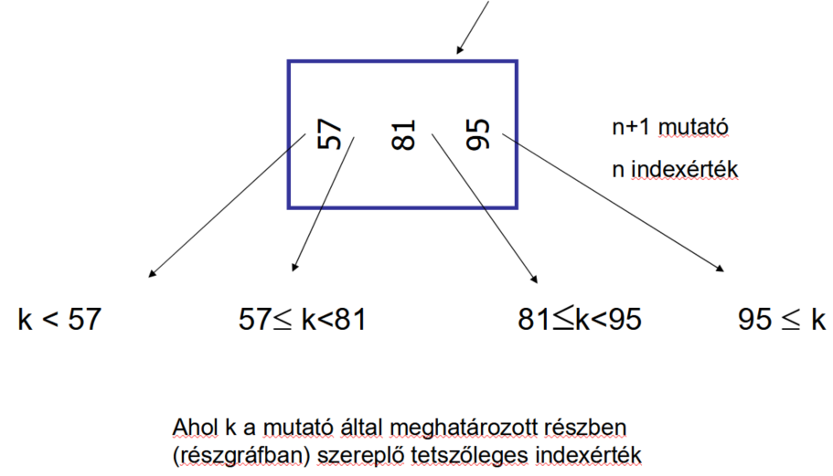
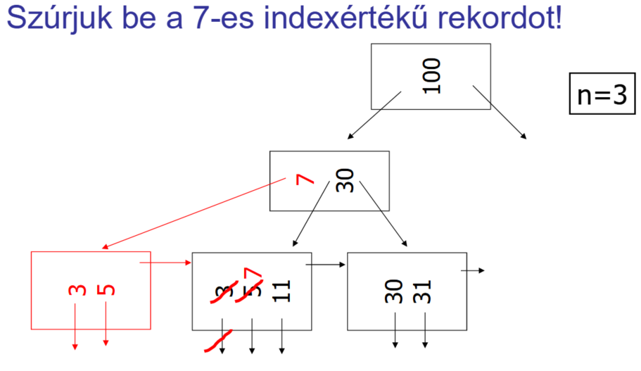
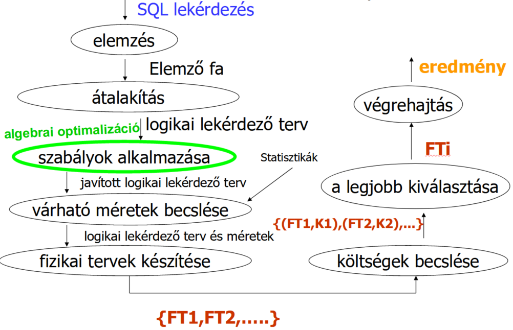
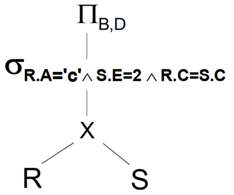

\def\ojoin{\setbox0=\hbox{$\bowtie$}%
	\rule[-.02ex]{.25em}{.4pt}\llap{\rule[\ht0]{.25em}{.4pt}}}
\def\leftouterjoin{\mathbin{\ojoin\mkern-5.8mu\bowtie}}
\def\rightouterjoin{\mathbin{\bowtie\mkern-5.8mu\ojoin}}
\def\fullouterjoin{\mathbin{\ojoin\mkern-5.8mu\bowtie\mkern-5.8mu\ojoin}}

\def\tef{\to\to}

Készült Kiss Attila előadásai alapján.

Sárközi Gergő, 2022-23-1. félév  
Nincsen lektorálva!

# Fizika (fizika.ppt)

## 1. Mit hívunk statikus, és mit dinamikus adatbázisnak? (1 pont) 

*1. oldal*

Statikus: ritkán módosul, a lekérdezések gyorsasága a fontosabb  
Dinamikus: gyakran módosul, ritkán végzünk lekérdezéseket

## 2. Fogalmazzunk meg 3 célt, amire az indexelés kiválasztásánál figyelni kell! (3 pont)

*1. oldal*

Gyors lekérdezés, gyors adatmódosítás, minél kisebb tárolási méret

## 3. Mit tételezünk fel, mivel arányos a beolvasás, kiírás költsége? (1 pont)

*1. oldal*

Háttértároló és memória között mozgatott blokkok számával

## 4. Adjuk meg az alábbi paraméterek jelentését! l, b, B, T, bf, M, I(A) (7 pont)

*3, 5. oldal*

l: length, rekordméret bájtokban  
b: blokkméret bájtokban  
B: fájl mérete blokkokban  
T: tuple, rekordok száma  
bf: blokkolási faktor, blokkonként hány rekord fér el, $bf=\lfloor b/l \rfloor$  
M: memória mérete blokkokban  
I(A): képméret, "A" oszlopban szereplő különböző értékek száma

## 5. Adjuk meg RxS méretét blokkokban kifejezve! (2 pont)

*3. oldal*

$B(R \times S) = T(R) * T(S) * (I(R) + I(S)) / b = T(S)*B(R) + T(R)*B(S)$

## 6. Mit jelent az egyenletességi feltétel? (1 pont)

*4.oldal*

Egy $A=a$ feltételt kielégítő rekordokból nagyjából azonos számú szerepel, a konkrét feltételtől függetlenül.

## 7. Mekkora adategységet olvas az író-olvasó fej? (1 pont)

*1. oldal*

Egy blokkot.

## 8. Mitől függhet a blokkméret? (1 pont)

*1. oldal*

Operációs rendszer, hardver, adatbázis-kezelő

## 9. Egyenletességi feltétel esetén hány blokkból áll a $\sigma_{A=a}(R)$ lekérdezés eredménye? (1 pont)

*5. oldal*

$B(\sigma_{A=a}(R)) = B(R) / I(A)$

## 10. Soroljunk fel legalább 7 különböző fájlszervezési módszert? (7 pont)

*5. oldal*

kupac (heap), hasító index (hash), rendezett állomány, elsődleges index (ritka index), másodlagos index (sűrű index), többszintű index, $B^+$-fa vagy $B^*$ fa

## 11. Kupac szervezés esetén mennyi a keresés költsége legrosszabb esetben? (1 pont)

*6. oldal*

$B$ (kupac mérete blokkokban)

## 12. Kupac szervezés esetén mennyi a beszúrás költsége? (1 pont)

*6. oldal*

Utolsó blokkba tesszük a rekordot, tehát 1 olvasás és 1 írás (azaz 2)

## 13. Mit mond meg a h(x) hasító függvény értéke? (1 pont)

*7. oldal*

Hogy melyik kosárba tartozik a rekord, amelynek indexmezőjének az értéke $x$.

## 14. Mikor jó egy hasító függvény és ilyenkor milyen hosszúak a blokkláncok? (2 pont)

*7. oldal*

Egy jó hasító függvény nagyjából egyenletesen sorolja be a rekordokat különböző kosarakba.  
Ilyenkor egy blokklánc $B/K$ blokkból áll, ahol $K$ a blokkláncok száma.

## 15. Mennyi a $\sigma_{A=a}(R)$ lekérdezés keresési költsége jó hasító index esetén? (1 pont)

*8. oldal*

Legyen $K$ a blokkláncok száma.  
Ha az indexmező és a keresési mező megegyezik, akkor $B/K$ ($B/K$ méretű kupacban keresés).  
Ha a kettő eltér, akkor $B$ ($B$ méretű kupacban keresés).

## 16. Ha túl nagynak választjuk a K-t hasításkor, akkor ez milyen problémát okozhat? (1 pont)

*8. oldal*

Blokkonként sokszor csak 1 rekord lesz tárolva, ami pazarolja a tárhelyet.

## 17. Milyen keresésre nem jó a hasító indexelés? (1 pont)

*8. oldal*

Intervallumos $(a < A < b)$ típusú keresésre.

## 18. Mit jelent a dinamikus hasító indexelés és milyen két fajtáját ismerjük? (3 pont)

*11. oldal*

Jelentése: a kosarak száma beszúráskor, törléskor változhat (nincsen előre rögzítve).  
Két tanult fajtája: kiterjeszthető (expandable) és lineáris

## 19. Kiterjeszthető hasítás esetén a h(K) érték alapján melyik kosárba kerül a rekord? (2 pont)

*11. oldal (utolsó bekezdés)*

Amelynek prefix kódja a $h(K)$ kezdő szelete. (Ha egy kosár kódja $i$ hosszú, akkor $h(K)$ $i$ hosszú kezdő szeletével kell megegyeznie a kódnak.)

Ha beszúrásnál nincs szabad hely a megfelelő kosárban, akkor a kosarat kettő osztjuk, a prefix kódjának a hosszát megnövelve eggyel.
A meglévő elemeket az új, hosszabb kód alapján a megfelelő új kosárba helyezzük.
Ezt a kettőosztást akár többször meg kell ismételni, amíg nem lesz szabad hely.

## 20. Milyen probléma keletkezhet kiterjeszthető hasító index esetén és mi rá a megoldás? (2 pont)

*13. oldal (utolsó bekezdés) és 14. oldal (első bekezdés)*

Ha a rekordok hasító értékének eleje sok bitben megegyezik, akkor hosszú (fa) ágak keletkezheznek.
A megoldás, hogy a fát egy tömbbel ábrázoljuk. A tömb mérete a kosarak prefix kódjainak hosszának 2-es alapú hatványa (pl. 2 hosszú kód esetén 4 hosszú a tömb).
Így a tömb $h(x)$-edik eleme megmutatja, hogy melyik kosárba való az adott rekord. Több tömb elem is mutathat ugyan arra a kosárra.

## 21. Lineáris hasító index esetén mikor nyitunk meg új kosarat? (1 pont)

*17. oldal*

Ha egy előre megadott értéket elér a kosarakra jutó átlagos rekordszám:
ha a rekordok száma osztva a kosarak számával átlép egy küszöb értéket.

## 22. Lineáris hasító index esetén a h(K) érték alapján melyik kosárba kerül a rekord? (2 pont)

*17. oldal (utolsó 2 bekezdés)*

Nézzük $h(K)$ utolsó $\log(n)$ bitjét, ahol $n$ a kosarak száma.  
Ha nincs ilyen sorszámú kosár, akkor nézzük azt a kosarat, amelyik sorszáma csak az első bitben tér el.  
Ha a kosárban van szabad hely, akkor abba tesszük bele.  
Ha nincs szabad hely, akkor a kosárhoz hozzáláncolunk egy új blokkot és abba tesszük bele.

## 23. Rendezett állomány esetén adjuk meg a bináris (logaritmikus) keresés lépéseit! (4 pont)

*21. oldal (utolsó előtti bekezdés)*

- Középső blokk beolvasása
- Ha nincs benne az $A=a$ értékű rekord: eldöntjük, hogy a blokklánc első vagy második felében szerepelhet-e
- Felezett blokklánc középső blokkjának beolvasásával folytatjuk a folyamatot
- Addig ismételjük, amíg megtaláljuk a rekordot vagy a blokklánc már csak 1 blokkból áll

## 24. Mennyi a keresési költség rendezett mező esetében? (1 pont)

*21. oldal (utolsó bekezdés)*

$\log_2(B)$

## 25. Mennyi a keresési költség rendezett mező esetében, ha gyűjtő blokkokat is használunk? (1 pont)

*22. oldal (utolsó előtti bekezdés)*

$\log_2(B-G)+G$ ahol $G$ a gyűjtő blokkok száma

## 26. Mennyi a keresési költség rendezett mező esetében, ha minden blokkot félig üresen hagyunk? (1 pont)

*23. oldal*

$\log_2(2*B)=1+\log_2(B)$

## 27. Milyen mindig az indexrekord szerkezete? (1 pont)

*24. oldal*

Az indexrekord egy $(a,p)$ kettes, ahol $a$ egy érték az indexelt oszlopban és $p$ egy blokkmutató (arra a blokkra mutat, amelyben az $A=a$ értékű rekordot tároljuk).  
Az indexrekordok mindig rendezetten vannak tárolva az indexérték szerint.

## 28. Adjuk meg az elsődleges index 5 jellemzőjét! (5 pont)

*25. oldal (1. bekezdés, 5 bajusz)*

- Főfájl is az index szempontja szerint rendezett (nem csak az indexfájl)
- Csak egy elsődleges index lehet (mert a főfájl csak egy szempont szerint lehet rendezett)
- Elég a főfájl minden blokkjának legkisebb rekordjához készíteni egy indexrekordot
- Indexrekordok száma: $T(I)=B$ (ritka index)
- Indexrekordok kevesebb helyet foglalnak, azaz egy blokkba több fér belőlük, mint főfájl rekordokból: $bf(I) >> bf$

## 29. Mit hívunk fedőértéknek? (1 pont)

*25. oldal*

Legnagyobb olyan indexérték, amely a keresett értéknél kisebb vagy egyenlő.

## 30. Mennyi a keresési költség elsődleges index esetén? (1 pont)

*25. oldal*

$1+\log_2(B(I))$ ahol $B(I)$ az indexfájl mérete blokkokban.

## 31. Adjuk meg a másodlagos index 5 jellemzőjét! (5 pont)

*33. oldal (1. bekezdés, első 5 bajusz)*

- Főfájl rendezetlen (de az indexfájl rendezett)
- Több másodlagos index is lehet
- Főfájl minden rekordjához kell készíteni egy indexrekordot
- Indexrekordok száma: $T(I)=T$ (sűrű index)
- Indexrekordok kevesebb helyet foglalnak, azaz egy blokkba több fér belőlük, mint főfájl rekordokból: $bf(I) >> bf$

## 32. Hogyan keresünk a másodlagos indexben és mennyi a keresés költsége? (5 pont)

*33. oldal (2. bekezdés)*

Binárist keresést használunk az indexfájlban. A talált indexrekord által mutatott blokkot még be kell olvasnunk, abban van a keresett főfájl rekord.  
A keresés költsége: $1+\log_2(B(I))$ ahol $B(I)$ az indexfájl mérete blokkokban  
A keresés lassabb, mint elsődleges index esetén, mert több indexrekord létezik ($B(I)$ nagyobb).

## 33. Mit hívunk klaszterszervezésű táblának? (1 pont)

*45. oldal (2. bekezdés)*

Egy tábla klaszterszervezésű az $A$ oszlopra nézve, ha az $A$ oszlopban azonos értékű sorok azonos vagy egymás utáni blokkokban helyezkednek el,
azaz az első találat után az összes többi található fellelhető soros beolvasással.

## 34. Mit hívunk klaszterindexnek? (1 pont)

*45. oldal (3. bekezdés)*

Ha egy fájl klaszterszervezésű az $A$ oszlopra nézve, akkor az $A$ oszlop indexe egy klaszterindex.

## 35. Mikor mondjuk, hogy 2 tábla klaszterszervezésű? (1 pont)

*45. oldal (4. bekezdés)*

Ha a táblák közös oszlopain egyező sorok egy blokkban vagy egymás utáni blokkokban helyezkednek el,
azaz összekapcsolás során az összetartozó sorok fellelhetők soros beolvasással.

## 36. Ha t szintű indexet használunk, mennyi a keresési költség blokkműveletek számában mérve? (1 pont)

*47. oldal (piros képlet)*

$\log_2(B(I^{(t)}))+t$, ahol $B(I^{(t)})$ a $t$-edik szinten található blokkok száma. Ha ezen a szinten csak 1 blokk van, akkor a keresési költség $t+1$.

## 37. Ha t szintű indexet használunk, a legfelső szinten milyen keresést használunk? (1 pont)

*47. oldal (2. bekezdés, 1. pont)*

Bináris (logaritmikus) keresést.

## 38. Ha t szintű indexet használunk és a legfelső szint 1 blokkból áll, akkor mennyi a keresési költség? (1 pont)

*47. oldal (2. bekezdés, 3. pont)*

$t+1$

## 39. Ha t szintű indexet használunk, mennyi az indexszintek blokkolási faktora és miért? (2 pont)

*47. oldal (2. bekezdés, 4. pont)*

Minden szintnek azonos a blokkolási faktora ($bf(I)$), mert az indexrekordok hossza megegyezik.
(Az indexrekordok egy $A$ oszlop értéket és egy blokkmutatót tárolnak. Ezek nem függnek a $t$ értékétől.)

## 40. Ha t szintű indexet használunk, vezessük le, hogy hány blokkból áll a legfelső szint! (12 pont)

*48. oldal (táblázat)*

A legfelső szint $B/bf(I)^t$ blokkból áll, mert a blokkok száma minden szinten ahányad részére csökken, amennyi indexrekord fér egy blokkba ($bf(I)$).  
A főfájl $B$ blokkból áll, az első szint $B/bf(I)$ blokkból, a második szint $B/bf(I)/bf(I)=B/bf(I)^2$ blokkból, stb.

Az indexfájlok rendezettek, ezért lehet őket elsődleges index-szel indexelni, ami ritka, azaz blokkonként elég egy indexrekord. Ezért kell minden lépésben $bf(I)$-vel osztani.  
Minden szintnek azonos a blokkolási faktora ($bf(I)$), mert az indexrekordok hossza megegyezik.
A rekordok száma szintén $bf(I)$ hányad részére csökken szintenként: főfájlban $T$ rekord van, 1. szinten $B$, t-edik szinten $B/bf(I)^{t-1}$.

## 41. Ha t szintű indexet használunk, és a legfelső szint 1 blokkból áll, abból milyen egyenlet következik és mi a megoldása t-re? (2 pont)

*48. oldal (táblázat alatti 1 pont)*

Az egyenlet: $1=B/bf(I)^t$  
Megoldás: $t=\log_{bf(I)}(B)$

## 42. Mi a két legfontosabb jellemzője a B+-faindexnek? (2 pont)

*49. oldal (telítettségre és algoritmusokra utaló mondatok)*

Többszintű indexelés egy megvalósítása. Egy adott szerkezetű fa, amelyben minden blokk legalább 50%-ban telített.
Ezt a telítettséget és a szerkezetet karbantartó algoritmusok biztosítják.

## 43. Egy példa alapján szemléltessük a köztes csúcs jellemzőit B+-fa index esetén! (8 pont)

*50. oldal (minden, ami szerepel rajta)*

$n$ darab indexértéket és $n+1$ darab mutatót tartalmaz. Erre a köztes csúcsra mutat egy másik belső csúcs.

Legyen $k$ egy tetszőleges indexérték egy adott mutató által meghatározott részgráfban.  
Legbaloldalibb mutató: $k < \text{első indexérték}$  
Középső mutatók: $\text{előző indexérték} \le k < \text{következő indexérték}$  
Legjobboldalibb mutató: $\text{utolsó indexérték} \le k$  
(Ahhoz, hogy ez egy példa legyen konkrét számokat be kéne helyettesíteni. Rajzolni valószínűleg jó ötlet.)

{ width=40% }

## 44. Egy példa alapján szemléltessük a levél csúcs jellemzőit B+-fa index esetén! (5 pont)

*51. oldal (minden, ami szerepel rajta)*

$n$ darab indexértéket és $n+1$ darab mutatót tartalmaz, ahol a +1 mutató sorrendben a következő levélre mutat. Levél csúcsokra egy belső csúcs is mutat.

A többi mutató az indexértékkel megegyező tartalmú rekordra (nem pedig blokkra!) mutat.
(Ahhoz, hogy ez egy példa legyen konkrét számokat be kéne helyettesíteni. Rajzolni valószínűleg jó ötlet.)

{ width=30% }

## 45. Mutassunk példát, mikor beszúráskor egy levélcsúcsot kettéosztunk B+-fa index esetén! (5 pont)

*53. oldal (mit szúrunk be és a beszúrás előtti, majd utáni két fát kell lerajzolni)*

{ width=40% }

## 46. Mutassunk példát, mikor beszúráskor egy köztes csúcsot kettéosztunk B+-fa index esetén! (5 pont)

*54. oldal (mit szúrunk be és a beszúrás előtti, majd utáni két fát kell lerajzolni)*

{ width=40% }

## 47. Mutassunk példát, mikor beszúráskor nő a B+-fa index magassága! (5 pont)

*55. oldal (mit szúrunk be és a beszúrás előtti, majd utáni két fát kell lerajzolni)*

{ width=40% }

## 48. Mutassunk példát, mikor törléskor megszüntetünk egy levélcsúcsot B+-fa index esetén! (5 pont)

*56. oldal (mit törlünk és a törlés előtti, majd utáni két fát kell lerajzolni)*

{ width=40% }

## 49. Mutassunk példát, mikor törléskor csökken a B+-fa index magassága! (5 pont)

*58. oldal (mit törlünk és a törlés előtti, majd utáni két fát kell lerajzolni)*

{ width=40% }

# Indexek (08-indexek-1.ppt)

## 50. Mutassunk példát arra, mikor egy kevés elemszámú oszlopra bitmap indexet készítünk! (2 pont)

*33. oldal (a tábla, és a régióra készített index)*

Adatok:

| ID | Név | Régió |
|:-:|:-:|:-:|
| 101 | John Smith | east |
| 102 | Robert Williams | central |
| 103 | Mary Brown | west |
| 104 | Susan Miller | central |

Bitmap a 'Régió' oszlopra:

| Régió='east' | Régió='central' | Régió='west' |
|:-:|:-:|:-:|
| 1 | 0 | 0 |
| 0 | 1 | 0 |
| 0 | 0 | 1 |
| 0 | 1 | 0 |

## 51. Mutassunk példát arra, mikor logikai feltételek kiértékelését bitmap vektorműveletekre vezetjük vissza! (7 pont)

*34. oldal (a lekérdezés, a vektorműveletek, és a lekérdezés eredménye: az utolsó vektorban az egyesek száma)*

Lekérdezés: `SELECT COUNT(*) FROM CUSTOMER WHERE STATUS='married' AND REGION IN ('central', 'west');`

| status = 'married' | AND | region = 'central' | OR | region = 'west' | = | status | AND | region | = | Eredmény |
|:-:|:-:|:-:|:-:|:-:|:-:|:-:|:-:|:-:|:-:|:-:|
| 0 |     | 0 |     | 0 |   | 0 |     | 0 |   | 0 |
| 1 | AND | 1 | OR  | 0 | = | 1 | AND | 1 | = | 1 |
| 1 |     | 0 |     | 1 |   | 1 |     | 1 |   | 1 |
| 0 |     | 0 |     | 1 |   | 0 |     | 1 |   | 0 |

Az eredmény az utolsó oszlopban az egyesek száma.

# Algebrai optimalizálás (algebrai opt.ppt)

## 52. Mi a lekérdezések optimalizálásának a célja és miket használunk fel ehhez? (5 pont)

*91. oldal (A cél pontos megfogalmazása.)*

A cél a lekérdezések gyorsabbá tétele a táblakra vonatkozó paraméterek, statisztikák, indexek ismeretében és általános érvényű tuladonságok, heurisztikák segítségével.

## 53. Adjuk meg a lekérdezések optimalizálásának folyamatábráját! (19 pont)

*100. oldal (A folyamatábrán szereplő csúcsok, feliratok mindegyike 1 pont)*

{ width=40% }

## 54. Adjuk meg egy egyszerű relációs algebrai kifejezést és gráfos ábrázolását! (4 pont)

*95. oldal (A kifejezés és a gráf)*

A $\Pi_{B,D}( \sigma_{R.A='c' \wedge S.E=2 \wedge R.C = S.C} (R \times S) )$ kifejezés gráfként:

{ width=15% }

## 55. Milyen költségmodellt használunk relációs algebrai optimalizálás esetében? (2 pont)

*106. oldal (Költségmodell)*

A kiszámítás költsége arányos a relációs algebrai kifejezés részkifejezéseinek megfelelő relációk tárolási méreteinek összegével.

## 56. Mi a módszer lényege relációs algebrai optimalizálás esetében? (3 pont)

*106. oldal (Módszer)*

Műveletei tulajdonságokon alapuló ekvivalens átalakítások alkalmazása, hogy várhatóan kisebb méretű relációk keletkezzenek.

## 57. Miért mondjuk, hogy az eljárás heurisztikus relációs algebrai optimalizálás esetén? (2 pont)

*106. oldal (4. pont)*

Mert az eljárás nem az argumentum relációk valódi méreteivel számol.

## 58. Miért nem egyértelmű az eredmény relációs algebrai optimalizálás esetén? (4 pont)

*106. oldal (4. pont)*

Mert az átalakítások sorrendje nem determinisztikus, így más sorrendben végrehajtva az átalakításokat más végeredményt kaphatunk.
Mindegyik végeredmény általában jobb költségű, mint amiből kiindultunk.

## 59. A relációs algebrai kifejezésfában melyek az unáris csúcsok? (3 pont)

*107. oldal (unáris csúcsok felsorolása)*

Unáris csúcsok: $\sigma ,\; \Pi ,\; \rho$ (szelekció, projekció, átnevezés)

## 60. A relációs algebrai kifejezésfában melyek a bináris csúcsok? (3 pont)

*107. oldal (bináris csúcsok felsorolása)*

Bináris csúcsok: $- ,\; \cup ,\; \times$ (kivonás, unió, összekapcsolás)

## 61. A relációs algebrai kifejezésfában mik a levélcsúcsok? (2 pont)

*107. oldal (kétféle lehet)*

Levél csúcsok: konstans relációk vagy relációs változók

## 62. Mit hívunk ekvivalens relációs algebrai kifejezéseknek? (3 pont)

*110. oldal (1. pont)*

Két kifejezés ekvivalens, ha tetszőleges relációk esetén azonos eredményeket adnak.

$E_1(r_1,...,r_k)$ és $E_2(r_1,...,r_k)$ ekvivalensek ($E_1 \cong E_2$), ha tetszőleges $r_1, ..., r_k$ relációk esetén $E_1(r_1,...,r_k) = E_2(r_1,...,r_k)$.

## 63. Hány szabálycsoportot adunk meg relációs algebrai optimalizáláskor és mi jellemző ezekre? (4 pont)

*110. oldal (2. és 3. pont, összesen 4 mondat)*

11 szabályt (szabálycsoportot) adunk meg. A szabályok kifejezések ekvivalenciáját kimondó bizonyítható állítások.  
Az állítások egy részében a kifejezések szintaktikus helyessége egyben elégséges feltétele is az ekvivalenciának.

## 64. Adjuk meg a relációs algebrai optimalizálás kommutatív szabályait! (3 pont)

*110. oldal (3 szabály)*

1.: Kommutativitás: $E_1 \oplus E_2 \cong E_2 \oplus E_1$ ahol $\oplus \in \{\times, \bowtie, \bowtie_F \}$

## 65. Adjuk meg a relációs algebrai optimalizálás asszociatív szabályait! (3 pont)

*111. oldal (3 szabály)*

2.: Asszociativitás: $(E_1 \oplus E_2) \oplus E_3 \cong E_1 \oplus (E_2 \oplus E_3)$ ahol $\oplus \in \{\times, \bowtie, \bowtie_F\}$

## 66. Adjuk meg a vetítésre vonatkozó összevonási, bővítés szabályt relációs algebrai optimalizálás esetén! (2 pont)

*111. oldal (szabály és feltétel)*

3.: Vetítések összevonása, bővítése: $\Pi_A(\Pi_B(E)) \cong \Pi_A(E)$ ha $A \subseteq B$

## 67. Adjuk meg a kiválasztások felcserélhetőségére, felbontására vonatkozó szabályt relációs algebrai optimalizálás esetén! (3 pont)

*111. oldal (2 ekvivalencia és feltétel)*

4.: Kiválasztások felcserélhetősége, felbontása: $\sigma_{F1 \wedge F2}(E) \cong \sigma_{F1}(\sigma_{F2}(E)) \cong \sigma_{F2}(\sigma_{F1}(E))$

## 68. Adjuk meg a kiválasztás és vetítés felcserélhetőségére vonatkozó szabályt relációs algebrai optimalizálás esetén! (2 pont)

*112. oldal (az a) szabály és feltétele)*

5.: Kiválasztás és vetítés felcserélhetősége: $\Pi_A(\sigma_F(E)) \cong \sigma_F(\Pi_A(E))$ ahol $F$ csak az $A$ oszlopokat nézi

## 69. Adjuk meg a kiválasztás és vetítés felcserélhetőségére vonatkozó általánosított szabályt rel. algebrai optimalizálás esetén! (2 pont)

*112. oldal (a b) szabály és feltétele)*

5.: Kiválasztás és vetítés felcserélhetősége, általánosabban: $\Pi_A(\sigma_F(E)) \cong \Pi_A(\sigma_F(\Pi_{A \cup B}(E)))$ ahol $F$ az $A \cup B$ oszlopokat nézi és $A \cap B = \emptyset$ (azaz $B$-t $F$ alapján határozzuk meg)

## 70. Adjuk meg a kiválasztás és szorzás felcserélhetőségére vonatkozó szabályt relációs algebrai optimalizálás esetén! (2 pont)

*112. oldal (a szabály és feltétele)*

6.: Kiválasztás és szorzás felcserélhetősége: $\sigma_F(E_1 \times E_2) \cong \sigma_F(E_1) \times E_2$ ahol $F$ csak $E_1$-et használja

## 71. Adjuk meg a kiválasztás és szorzás felcserélhetőségére vonatkozó speciális szabályt relációs algebrai optimalizálás esetén! (2 pont)

*112. oldal (a speciális szabály és feltétele)*

6.: Kiválasztás és szorzás felcserélhetősége, speciálisan: $\sigma_F(E_1 \times E_2) \cong \sigma_{F1}(E_1) \times \sigma_{F2}(E_2)$
ahol $F=F1 \wedge F2$ és $Fi$ csak $E_i$-t ellenőrzi

## 72. Adjuk meg a kiválasztás és szorzás felcserélhetőségére vonatkozó általánosított szabályt rel. algebrai optimalizálás esetén! (3 pont)

*112. oldal (az általános szabály és feltételei)*

6.: Kiválasztás és szorzás felcserélhetősége, általánosabban: $\sigma_F(E_1 \times E_2) \cong \sigma_{F2}(\sigma_{F1}(E_1) \times E_2)$
ahol $F=F1 \wedge F2$ és $F1$ csak $E_1$-et, de $F2$ $E_1 \times E_2$-t nézi

## 73. Adjuk meg a kiválasztás és egyesítés felcserélhetőségére vonatkozó szabályt relációs algebrai optimalizálás esetén! (2 pont)

*113. oldal (a szabály és feltétele)*

7.: Kiválasztás és egyesítés felcserélhetősége: $\sigma_F(E_1 \cup E_2) \cong \sigma_F(E_1) \cup \sigma_F(E_2)$ ahol $E_i$ azonos sémájú

## 73,5. Adjuk meg a kiválasztás és kivonás felcserélhetőségére vonatkozó szabályt relációs algebrai optimalizálás esetén! (2 pont)

*113. oldal (de ez nem volt az eredeti kérdéssorban)*

8.: Kiválasztás és kivonás felcserélhetősége: $\sigma_F(E_1 - E_2) \cong \sigma_F(E_1) - \sigma_F(E_2)$ ahol $E_i$ azonos sémájú

## 74. Adjuk meg a kiválasztás és természetes összekapcsolás felcserélhetőségére vonatkozó szabályt relációs algebrai optimalizálás esetén! (2 pont)

*113. oldal (a szabály és feltétele)*

9.: Kiválasztás és természetes összekapcsolás felcserélhetősége: $\sigma_F(E_1 \bowtie E_2) \cong \sigma_F(E_1) \bowtie \sigma_F(E_2)$ ahol $F$ az $E_i$ közös oszlopain értelmezett

## 75. Adjuk meg a vetítés és szorzás felcserélhetőségére vonatkozó szabályt relációs algebrai optimalizálás esetén! (2 pont)

*114. oldal (a szabály és feltétele)*

10.: Vetítés és szorzás felcserélhetősége: $\Pi_A(E_1 \times E_2) \cong \Pi_{A1}(E_1) \times \Pi_{A2}(E_2)$
ahol $A=A_1 \cup A_2$ és $A_i$ az $E_i$ oszlopainak részhalmaza

## 76. Adjuk meg a vetítés és egyesítés felcserélhetőségére vonatkozó szabályt relációs algebrai optimalizálás esetén! (2 pont)

*114. oldal (a szabály és feltétele)*

11.: Vetítés és egyesítés felcserélhetősége: $\Pi_A(E_1 \cup E_2) \cong \Pi_{A}(E_1) \cup \Pi_{A}(E_2)$
ahol $E_i$ sémája azonos és $A$ az oszlopaik egy részhalmaza

## 77. Mutassunk példát, hogy a kivonás és a vetítés nem felcserélhető! (2 pont)

*114. oldal (a megjegyzésben leírt példa)*

Példa $\Pi_A (E_1 - E_2) \ncong \Pi_A (E_1) - \Pi_A (E_2)$ bizonyítására:  
Legyen $E_1 = [ \{A=0, B=0\}, \{A=0, B=1\} ]$ és $E_2 = [ \{A=0, B=0\} ]$  
Ekkor $\Pi_A(E_1 - E_2) = [ \{A=0\} ]$ de $\Pi_A(E_1) - \Pi_A(E_2) = \emptyset$

## 78. Fogalmazzuk meg a relációs algebrai optimalizálás 4 heurisztikus elvét! (4 pont)

*115. oldal (Vastagon szedett mondatok)*

- Minél hamarabb szelektáljunk
- Próbáljunk természetes összekapcsolásokat képezni
- Vonjuk össze az egymás utáni unáris műveleteket
- Keressünk közös részkifejezéseket

## 79. Miért érdemes hamarabb szelektálni relációs algebrai optimalizálás esetén? (1 pont)

*115. oldal (1. pont)*

Hogy a részkifejezések várhatóan kisebb relációk legyenek.

## 80. Miért érdemes természetes összekapcsolásokat képezni szorzások helyett relációs algebrai optimalizálás esetén? (1 pont)

*115. oldal (2. pont)*

Mert az összekapcsolás hatékonyabban kiszámolható, mint a szorzatból történő kiválasztás.

## 81. Miért érdemes az unáris műveleteket összevonni relációs algebrai optimalizálás esetén? (1 pont)

*115. oldal (3. pont)*

Mert így csökken a műveletek száma, és általában a kiválasztás kisebb relációt eredményez, mint a vetítés.

## 82. Miért érdemes a közös részkifejezéseket megkeresni relációs algebrai optimalizálás esetén? (1 pont)

*115. oldal (4. pont)*

Mert így elég őket csak egyszer kiszámolni a kifejezés kiértékelése során.

## 83. A relációs algebrai optimalizálás algoritmusának mi az inputja és mi az outputja? (2 pont)

*116. oldal (input, output)*

Input: relációs algebrai kifejezés kifejezésfája  
Output: optimilizált kifejezésfa optimilizált kiértékelése

## 84. Mi a relációs algebrai optimalizálás algoritmusának 1. lépése (az alkalmazott szabályok felsorolása nélkül)? (2 pont)

*116. oldal (1. lépés)*

Kiválasztások felbontása.

## 85. Mi a relációs algebrai optimalizálás algoritmusának 2. lépése (az alkalmazott szabályok felsorolása nélkül)? (2 pont)

*116. oldal (2. lépés)*

Kiválasztások olyan mélyre vitele a kifejezésfában, amilyen mélyre csak lehetséges.

## 86. Mi a relációs algebrai optimalizálás algoritmusának 3. lépése (az alkalmazott szabályok felsorolása nélkül)? (2 pont)

*116. oldal (3. lépés)*

Vetítések olyan mélyre vitele a kifejezésfában, amilyen mélyre csak lehet.  
Olyan vetítések elhagyása, amik a reláció összes attribútumára vetítenek (triviális vetítések).

## 87. Mi a relációs algebrai optimalizálás algoritmusának 4. lépése (az alkalmazott szabályok felsorolása nélkül)? (2 pont)

*116. oldal (4. lépés)*

Közvetlenül egymás utáni kiválasztások vagy vetítések összevonása egy kiválasztássá vagy egy vetítéssé vagy egy kiválasztás utáni vetíttéssé, ha lehet.

## 88. Mi a relációs algebrai optimalizálás algoritmusának 5. lépése (az alkalmazott szabályok felsorolása nélkül)? (4 pont)

*116. oldal (5. lépés)*

Gráf bináris műveletek ($\cup ,\; - ,\; \times$) alapján részgráfokra bontása.
Egy részgráfhoz tartozik még a bináris műveleten végrehajtott kiválasztások és vetítések.

Ha a bináris művelet $\times$ és valamelyik argumentumban nincsen bináris művelet és a művelet részfája equi-joinnak felel meg, akkor az argumentum részfájával egyesíthető a művelet részfája.

## 89. Mi a relációs algebrai optimalizálás algoritmusának 6. lépése (az alkalmazott szabályok felsorolása nélkül)? (2 pont)

*116. oldal (6. lépés)*

Az előző lépésben kapott fa alulról felfelé haladó kiértékelése (tetszőleges sorrendben).

## 90. Adjunk meg egy példát, amiben a vetítések bővítése trükköt alkalmazzuk és indokoljuk, hogy mire jó ez! (8 pont)

*122. oldal (a teljes ábra)*

Ezzel a trükkel a bővített vetítést lejebb vihetjük a kifejezfában, mint az erdeti vetítést lehetne.
Ezzel kisebb részeredményeket kaphatunk a kiértékelés során, azaz optimálisabb megoldáshoz juthatunk.

{ width=35% }

# Költségbecslés, optimalizálás (optimization.ppt)

## 91. Mennyi az SC(A,R) szelektivitás értéke, ha A kulcs? (1 pont)

*11. oldal*

$SC(A,R) = 1$

## 92. Mennyi az SC(A,R) szelektivitás értéke, ha A nem kulcs (a jelölések magyarázatát is adjuk meg)? (1 pont)

*11. oldal*

$SC(A,R) = N_R / V(A,R)$ ahol $N_R$ az $R$ reláció rekordjainak száma és $V(A,R)$ az $A$ mező különböző értékeinek száma $R$-ben

## 93. Mennyi rendezett táblában a bináris keresés átlagos költsége, ha minden találatot be kell olvasni (a jelölések magyarázatát is adjuk meg)? (3 pont)

*13. oldal (bináris átlagos költség, m-re a képlet)*

$\lceil \log_2 B_R \rceil + m$ ahol $m = \lceil SC(A,R) / F_R \rceil - 1$  
$m$ adja meg, hogy hány további blokkot kell még megnézni, hogy minden találat meglegyen.  
$B_R$ jelentése: $R$ reláció tárolásához szükséges blokkok száma  
$SC(A,R)$ jelentése: átlagosan hány $A=a$ mező van $R$-ben  
$F_R$ jelentése: blokkolási tényező, $R$-ben egy blokkon hány rekord található

## 94. Mennyi B+-fa típusú elsődleges index esetén az átlagos keresési költség, ha minden találatot be kell olvasni (a jelölések magyarázatát is adjuk meg)? (2 pont)

*13. oldal (a legutolsó pont)*

$HT_i + \lceil SC(A,R)/F_R \rceil$  
$HT_i$ jelentése: $i$ index szintjeinek száma  
$SC(A,R)$ jelentése: átlagosan hány $A=a$ mező van $R$-ben  
$F_R$ jelentése: blokkolási tényező, $R$-ben egy blokkon hány rekord található

## 95. Mennyi B+-fa típusú másodlagos index esetén az átlagos keresési költség, ha minden találatot be kell olvasni (a jelölések magyarázatát is adjuk meg)? (2 pont)

*14. oldal (a szelektivitást tartalmazó képlet)*

$HT_i + \lceil SC(A,R) \rceil$  
$HT_i$ jelentése: $i$ index szintjeinek száma  
$SC(A,R)$ jelentése: átlagosan hány $A=a$ mező van $R$-ben

# Költségbecslés, optimalizálás (optimization-hu.ppt)

## 96. A $\sigma_{\theta_1 \wedge ... \wedge \theta_n}$ lekérdezésnek adjuk meg kétféle kiszámítási módját! (6 pont)

*15. oldal, 1. bajusz és 2. pötty, 2. bajusz és első három pötty*

- Ha több $\theta_i$-hez van indexünk, akkor indexek használatával keressük meg a hozzá tartozó feltételt kielégítő sorok azonosítóit (RID-eket) és vegyünk a RID-ek metszetét.
- Egyébként végezzük el a legkisebb költségű $\theta_i$ kiválasztást és a fennmaradó $\theta_i$ feltételek szerint szűrjük az eredményt.

## 97. A $\sigma_{\theta_1 \lor ... \lor \theta_n}$ lekérdezésnek adjuk meg kétféle kiszámítási módját! (3 pont)

*15. oldal, a diszjunkciós kiválasztás alatti 3 sor*

- Ha több $\theta_i$-hez van indexünk, akkor indexek használatával keressük meg a hozzá tartozó feltételt kielégítő sorok azonosítóit (RID-eket) és vegyünk a RID-ek unióját.
- Egyébként végezzünk lineáris keresést.

## 98. Milyen adatbázis műveletekhez kell rendezés? (5 pont)

*16. oldal, az 5 bajusz*

rendezés, unió, metszet, $\Pi$ (vetítésnél a duplikált értékek kiszűrése)

## 99. Milyen két fajtája van a rendezésnek? (2 pont)

*17. oldal, 3.1. 3.2*

Belső és külső rendezés. Belső rendezés akkor használható, ha a rekordok egyszerre beleférnek a memóriába.

## 100. Külső összefésülő rendezésnél mire jó a rendező lépés? (1 pont)

*18. oldal, első sor*

Rendezett futamok létrehozására. Egy futam egy $M$ hosszú $R_i$ fájl, ahol $M$ a memória mérete blokkokban.

## 101. Külső összefésülő rendezésnél mire jó az összevonási lépés? (1 pont)

*19. oldal, első sor*

Rendezett futamok összefésülésére. Több rendezett fájlból (futamból) készítünk egy rendezett fájlt.

## 102. Külső összefésülő rendezésnél mikor kell több menetben végezni az összevonási lépést? (2 pont)

*20. oldal, 2. pont, de a betűk magyarázata is kell*

Ha a futamok száma ($N$) meghaladja a memória méretét blokkokban kifejezve ($M$).
Azaz ha nem tudunk minden fájlhoz egy-egy külön memóriablokkot fenntartani, mert nincs elég memória.
(A futam egy rendezett fájl; ezeket kell összefésülni.)

Valójában $N \ge M$ esetén is erre van szükség, de ha így van az előadás dián...

## 103. Külső összefésülő rendezésnél mennyi a rendező lépés költsége? (2 pont)

*22. oldal, 2. pont, de a betűk magyarázata is kell*

$2*B_R$, azaz a rendezendő reláció blokkokban kifejezett méretének kétszerese.

## 104. Külső összefésülő rendezésnél mennyi összevonandó futam van kezdetben? (2 pont)

*22. oldal, 3.1. pont, de a betűk magyarázata is kell*

$\lceil B_R / M \rceil$ darab futam van kezdetben, azaz a rendezendő reláció méretét elosztjuk a memória méretével és felfelé kerekítjük.

## 105. Külső összefésülő rendezésnél mennyi az összes menetek száma? (2 pont)

*22. oldal, 3.3. pont, de a betűk magyarázata is kell*

$\lceil \log_{M-1} ( B_R / M ) \rceil$ menetre van szükség, ahol $M$ a memória mérete, $B_R$ pedig a rendezendő reláció mérete, mindkettő blokkokban értendő.
Magyarázat: minden menet $M-1$ futamot rendez, ezért minden menetben $M-1$-ed részére csökken a rendezendő futamok száma.

## 106. Külső összefésülő rendezésnél mennyi blokkot olvasunk minden menetben? (2 pont)

*22. oldal, 3.4. pont, de a betűk magyarázata is kell*

Hivatalos jegyzet:  
Minden menetben $2*B_R$ blokkot olvasunk, ahol $B_R$ a rendezendő reláció mérete blokkokban kifejezve.

Szerintem erre gondolt inkább:  
Minden menetben $B_R$ blokkot olvasunk és $B_R$ blokkot írunk, így egy menet költsége $2*B_R$ (ahol $B_R$ a rendezendő reláció mérete blokkokban kifejezve).
Az utolsó írás az kivétel, azt nem számoljuk bele a költségbe. $B_R$ pedig valójában csak egy felső becslés (amit az utolsó menetben el is érünk).

## 107. Külső összefésülő rendezésnél mennyi a teljes költség, a végeredmény kiírása nélkül? (4 pont)

*22. oldal, 3.4. pont, de a betűk magyarázata is kell*

$2*B_R + 2*B_R * \lceil \log_{M-1} (B_R / M) \rceil - B_R$ ahol $B_R$ a rendezendő reláció mérete, $M$ pedig a memória mérete, mindkettő blokkokban kifejezve

## 108. A vetítés milyen három lépés megvalósításából áll? (3 pont)

*23. oldal, 4. pont*

Kezdeti átnézés (felesleges mezők törlése), rendezés, végső átnézés (duplikáltak törlése, amik most már szomszédosak)

## 109. Soroljuk fel az összekapcsolás 5 megvalósítását! (5 pont)

*24. oldal, 2. pont*

- Skatulyázott ciklusos (nested loop) összekapcsolás
- Blokk-skatulyázott ciklusos (block-nested loop) összekapcsolás
- Indexelt skatulyázott ciklusos összekapcsolás
- Összefésüléses rendező összekapcsolás
- Hasításos összekapcsolás

## 110. Skatulyázott (NestedLoop) összekapcsolásnál mennyi a költsége legjobb esetben? (3 pont)

*25. oldal, 1.1 pont mindhárom sora*

A legjobb eset akkor lép fel, ha a (kisebb) reláció elfér a memóriában. Ekkor legyen ez a belső reláció.
A költség: $B_R + B_S$ (ahol $B_X$ az $X$ reláció méretét jelenti blokkokban kifejezve)

## 111. Skatulyázott (NestedLoop) összekapcsolásnál mennyi a költsége legrosszabb esetben? (3 pont)

*25. oldal, 1.2 pont mindhárom sora*

A legroszabb eset akkor lép fel, ha mindkettő relációból csak 1-1 lap fér bele a memóriába.
Ekkor minden ($R$-beli) rekordhoz végig kell olvasni a másik reláció ($S$) összes blokkját, így a költség: $N_R * B_S + B_R$
(ahol $B_X$ az $X$ reláció méretét jelenti blokkokban kifejezve, $N_R$ pedig az $R$ relációban található rekordok számát)

## 112. Blokk-Skatulyázott (BlockNestedLoop) összekapcsolásnál mennyi a költség legjobb esetben? (3 pont)

*28. oldal, 1.1 pont mindhárom sora*

A legjobb eset akkor lép fel, ha a (kisebb) reláció elfér a memóriában. Ekkor legyen ez a belső reláció.
A költség: $B_R + B_S$ (ahol $B_X$ az $X$ reláció méretét jelenti blokkokban kifejezve)

## 113. Blokk-Skatulyázott (BlockNestedLoop) összekapcsolásnál mennyi a költség legrosszabb esetben? (3 pont)

*28. oldal, 1.2 pont mindhárom sora*

A legroszabb eset akkor lép fel, ha mindkettő relációból csak 1-1 lap fér bele a memóriába.
Ekkor minden ($R$-beli) blokkhoz végig kell olvasni a másik reláció ($S$) összes blokkját, így a költség: $B_R * B_S + B_R$
(ahol $B_X$ az $X$ reláció méretét jelenti blokkokban kifejezve)

## 114. Indexelt összekapcsolásnál mennyi a költség? (3 pont)

*29. oldal, 4. pont mindhárom sora*

Legyen $c$ a belső relációból index szerinti kiválasztás költsége, továbbá legyen a kevesebb rekordot tartalmazó reláció a külső reláció ($R$).
Ekkor a költség: $B_R + N_R * c$ (ahol $B_R$ az $R$ reláció mérete blokkokban kifejezve, $N_R$ pedig az $R$ relációban található rekordok száma)

## 115. Rendezéses-Összefésüléses összekapcsolásnál mennyi a költség? (3 pont)

*30. oldal, 5. pont*

A költség: $\text{rendezés költsége} + B_S + B_R$ (ahol $B_X$ az $X$ reláció mérete blokkokban kifejezve)

## 116. Hasításos összekapcsolásnál mennyi a költség? (3 pont)

*31. oldal, 4. pont*

A költség: $2*(B_R + B_S) + (B_R+B_S)$ (ahol $B_X$ az $X$ reláció mérete blokkokban kifejezve)

## 117. Hasításos összekapcsolásnál mekkora méretű kosarakat képezünk? (2 pont)

*31. oldal, 2. pont első sora*

Ami állítólag a válasz, de a kérdésre nem válaszol:  
Alkalmazzuk $h_1$-et (hash függvény) az összekapcsolási mezőre és felosztjuk a rekordokat memóriában elférő részekre.

A választ esetleg a kosarak számának függvényében lehetne megadni, de akkor is kérdéses, hogy mennyi konstans extra memóriára van szükség.
A kosarak száma pedig nem triviális és egy hash függvény nem ad garanciát arra, hogy egy fix méretű kosárba bele fog férni minden szükséges rekord.

## 118. Hány sora van a $\sigma_{A=v}(R)$ lekérdezés eredményének? (2 pont)

*40. oldal, 1. pont*

$SC(A,R)$, azaz annyi, ahány $A=a$ mező van $R$-ben átlagosan.
Ha $A$ kulcs, akkor $SC(A,R)=1$, egyébként $SC(A,R)=N_R/V(A,R)$ (ahol $N_R$ a rekordok száma, $V(A,R)$ pedig az $A$ mező különböző értékeinek száma).

## 119. Hány sora van a $\sigma_{A \le v}(R)$ lekérdezés eredményének? (2 pont)

*40. oldal, 2. pont*

$N_R * \frac{v-\min(A,R)}{\max(A,R)-\min(A,R)}$ ahol $N_R$ a rekordok száma, $\min$ és $\max$ pedig az adott mező minimális/maximális előforduló értéke.

## 120. Hány sora van a $\sigma_{\theta_0 \wedge ... \wedge \theta_n}(R)$ lekérdezés eredményének? (2 pont)

*40. oldal, 3. pont*

$N_R * (\frac{s_1}{N_R} * ... * \frac{s_n}{N_R})$ ahol $s_i$ ($\theta_i$ szelektivitása) a rekordok száma, amik $\theta_i$-t kielégítik (valószínűségi alapon),
$N_R$ pedig a relációban lévő rekordok száma.

## 121. Hány sora van a $\sigma_{\theta_0 \lor ... \lor \theta_n}(R)$ lekérdezés eredményének? (2 pont)

*40. oldal, 4. pont, 2. sor*

$N_R * (1-[(1-\frac{s_1}{N_R}) * ... * (1-\frac{s_n}{N_R})])$ ahol $s_i$ ($\theta_i$ szelektivitása) a rekordok száma, amik $\theta_i$-t kielégítik (valószínűségi alapon),
$N_R$ pedig a relációban lévő rekordok száma.

## 122. Hány sora van az $R \times S$ lekérdezés eredményének? (2 pont)

*41. oldal, 1. pont*

$N_R * N_S$, ahol $N_X$ az $X$ relációban található rekordok számát adja meg

## 123. Hány sora van az $R \bowtie S$ lekérdezés eredményének, ha $R \cap S = \emptyset$? (2 pont)

*41. oldal, 2.1.*

$N_R * N_S$, ahol $N_X$ az $X$ relációban található rekordok számát adja meg

## 124. Hány sora van az $R \bowtie S$ lekérdezés eredményének, ha $R \cap S$ kulcs R-en? (2 pont)

*41. oldal, 2.2.*

$N_S$, azaz az $S$ reláció sorainak száma

## 125. Hány sora van az $R \bowtie S$ lekérdezés eredményének, ha $R \cap S$ idegen kulcs R-hez? (2 pont)

*41. oldal, 2.3.*

$N_S$, azaz az $S$ reláció sorainak száma

## 126. Hány sora van az $R \bowtie S$ lekérdezés eredményének, ha $R \cap S = \{A\}$ sem R-nek, sem S-nek nem kulcsa? (2 pont)

*41. oldal, 2.4.*

$N_R * N_S / V(A,S)$, ahol $N_X$ az $X$ reláció sorainak számát, $V(A,S)$ pedig az $A$ mező különböző értékeinek számát ($S$-ben) adja meg.  
Felső becsléshez $R$ és $S$ fordítva is behelyettesíthető és a két eredmény maximumát lehet venni.

# Összekapcsolás sorrend (20.joinorder.ppt)

## 127. Mi a szabályos zárójelezések számának rekurzív képlete? (2 pont)

*9. oldal, 1.2 két sora*

Legyen $T(n)$ az $n$ tagú kifejezés lehetséges zárójelezéseinek száma.  
$T(1) = 1$  
$T(n) = \sum_{i=1}^{n-1} T(i) * T(n-i)$

## 128. Mennyi n tagú Join fa van? (2 pont)

*9. oldal, T(n)n!, ahol T(n) az n elem szabályos zárójelezéseinek száma*

$T(n) * n!$ darab, ahol $T(n)$ az $n$ tagú kifejezés lehetséges zárójelezéseinek száma.

## 129. 5 tagú összekapcsolás sorrendjének legjobb tervét dinamikus programozási elvet alkalmazva hogyan számoljuk ki? (3 pont)

*13. oldal, 2. pont*

Egy $n-1$ tagú összekapcsolás eredményéhez hozzákapcsoljuk az $n$-edik tagok. Az $n$ lehetséges kombináció közül a legkisebb költségűt választjuk.

~~~
BestPlan(A,B,C,D,E) = min of (
    BestPlan(A,B,C,D) |X| E,
    BestPlan(A,B,C,E) |X| D,
    BestPlan(A,B,D,E) |X| C,
    BestPlan(A,C,D,E) |X| B,
    BestPlan(B,C,D,E) |X| A
)
~~~

# Összekapcsolás sorrend (09_qp_opt.ppt)

## 130. Több-tagú összekapcsolás suboptimális sorrendjét milyen algoritmussal lehet előállítani, és a tartalmazási hálón milyen irányban halad a kiértékelés? (2 pont)

*20. oldal, cím és nyíl*

Az algoritmus neve "Selinger algoritmus" és a kiértékelés lentről (egyedül álló relációk szintjéről) felfelé halad (egyre több darab reláció van összekapcsolva).

# Tétel 9 (Tetel9_kidolgozott.pdf)

## 131. A `Q(A,B) JOIN R(B,C) JOIN S(C,D)` lekérdezésnek melyik három kiértékelését hasonlítottuk össze, és melyik volt a legjobb ezek közül? (4 pont)

*1. oldal a, b, c.c, volt a legjobb.*

a) balról jobbra
b) balról jobbra és a memóriában összekapcsolva a harmadik táblával
c) középső ténytábla soraihoz kapcsolva a szélső dimenziótáblákat (ez volt a legjobb)

## 132. A `Q(A,B) JOIN R(B,C) JOIN S(C,D)` lekérdezésnek három kiértékelésénél milyen indexeket tételeztünk fel? (2 pont)

*1. oldal 2. sor*

Létezik `Q.B`-re és `S.C`-re klaszterindex.

## 133. Az `R(A,B) JOIN S(B,C)` lekérdezés eredményében mennyi a sorok száma? (2 pont)

*1. oldal 2) képlet*

$T_{R \bowtie S} = T_R * T_S / I$, ahol $T$ a sorok számát, $I$ pedig az $S.B$ oszlopon előforduló különböző értékek számát jelöli.

## 134. Az `R(A,B) JOIN S(B,C)` lekérdezés eredménye hány blokkból áll? (2 pont)

*1. oldal 3) képlet*

$(T_R * B_S + T_S * B_R) / I$, ahol $T$ a sorok számát, $B$ a reláció méretét blokkokban, $I$ pedig az $S.B$ oszlopon előforduló különböző értékek számát jelöli.  
Megjegyzés: $R \times S$ esetén a válasz $T_R * B_S + T_S * B_R$ lenne.

## 135. A `Q(A,B) JOIN R(B,C) JOIN S(C,D)` lekérdezésnek balról jobbra (a) kiértékelésénél milyen költségek összege lesz a teljes költség, és mennyi a teljes költség? (5 pont)

*2. oldal a) a teljes JOIN I/O költsége: négy sora és a) végeredménye*

Első join költsége: $B + T*B/I$  
Első join kiírása: $2*T*B/I$  
Második join költsége: $2*T*B/I + [(T^2/I)*B]/I$  
Második join kiírása: $3*T^2*B/I^2$  
Teljes költség (előzőek összeadva): $B+5*T*B/I+4*T^2*B/I^2$

## 136. A `Q(A,B) JOIN R(B,C) JOIN S(C,D)` lekérdezésnek balról jobbra (b) kiértékelésénél mennyit lehet megspórolni és mennyi a teljes költség? (5 pont)

*2. oldal ab) magyarázatában szereplő képlet és b) végeredménye*

Megspórolhatjuk az első join eredményének kiírását majd újboli beolvasását ($2 * (2*T*B/I)$).  
Teljes költség: $B + T*B/I + 4*T^2*B/I^2$

## 137. A `Q(A,B) JOIN R(B,C) JOIN S(C,D)` lekérdezésnek c) kiértékelésénél (középső ténytáblához indexek alapján kapcsoljuk a dimenziótáblákat) milyen költségek összege lesz a teljes költség, és mennyi a teljes költség? (4 pont)

*2. oldal c) három képlete és c) végeredménye*

Q beolvasása: $B$  
Q és S olvasása $R$ minden sorára: $T * (B/I + B/I)$  
Eredmény kiírása: $3 * T^2 * B/I^2$  
Teljes költség: $B + 2*T*B/I + 3*T^2*B/I^2$

## 138. A `Q(A,B) JOIN R(B,C) JOIN S(C,D)` lekérdezésnek c) és b) kiértékelésének költségei hogy aránylanak egymáshoz, és milyen feltétel szükséges ehhez? (2 pont)

*2. oldal utolsó két mondat.*

Nagyméretű táblák esetén $T/I$ nagy lesz, ezért a négyzetes tag jóval nagyobb lesz, mint a lineáris tag, tehát a c) módszer a leghatékonyabb.

A $c/b$ arány $3/4$-hez tart, ha T/I tart a végtelenbe. Vagyis ha $T/I$ elég nagy, akkor c) költsége nagyjából $3/4$-e a b)-nek.

# Hangolás (9ituning-hu.ppt)

## 139. A legjobb átfutás mit optimalizál? (2 pont)

*7. oldal, legjobb átfutáshoz tartozó 2 sor.*

A cél az eredmény minden sorát minél hamarabb visszaadni. Először számolás, aztán gyors visszatérés.

## 140. A legjobb válaszidő mit optimalizál? (2 pont)

*7. oldal, legjobb válaszidőhöz tartozó 2 sor.*

A cél az eredmény első sorát minél hamarabb visszaadni. Számolás közben már térjen vissza, ha lehetséges.

## 141. Adjuk meg a ROWID szerkezetét, és egy példát is rá Oracle esetében! (2 pont)

*11. és 12. oldal, alul.*

Előadáson tanult: `<Blokk>.<Sor>.<Fájl>`  

Példa: (ezt le lehet rajzolni)  
Van egy fájlunk, melynek azonosítója X. A fájl 1-től sorszámozott blokkokból áll, amik 1-től sorszámozott rekordokból állnak.
A ROWID-ben a blokkok és a sorok 0-tól vannak sorszámozva. Az X fájl 7. blokkjának első sorának ROWID-je: `00000006.0000.0000X`

Gyakorlaton tanult: Base64 kódolt 18 karakter hosszú szöveg `OOOOOOFFFBBBBBBRRR` formátumban.  
O: adatobjektum azonosító  
F: fájl azonosító  
B: blokk azonosító  
R: sor azonosító

## 142. Mi az `Explain plan for <SQL-utasítás>` utasítás hatása? (2 pont)

*17. oldal első bajusz.*

Elmenti a tervet (forrás sorokat és műveleteket) a `Plan_Table`-be. Majd a `Plan_Table` nézetén (vagy külső eszközön) keresztül olvasható tervet kapunk.

## 143. Jellemezzük a `SELECT * FROM emp WHERE rowid='00004F2A.00A2.000C'` utasítást! (4 pont)

*26. alsó keret teljes tartalma.*

Mivel `rowid` alapján keresünk, így egyetlen sor megkeresése a feladat.
A `rowid`-ben foglalt blokkot be kell olvasni és ki kell szűrni a megfelelő sort (amiben a `rowid` szintén segít, hiszen a sor azonosítót is tartalmazza).

`rowid` alapján való keresés a leggyorsabb módszer egy sor kinyerésére, de ehhez persze tudni kell a `rowid`-t előre.
