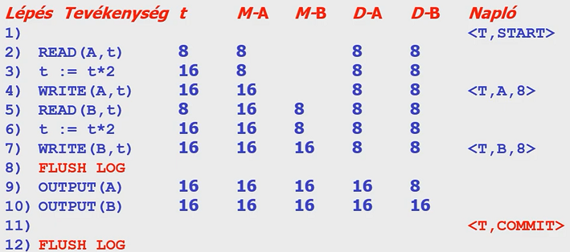
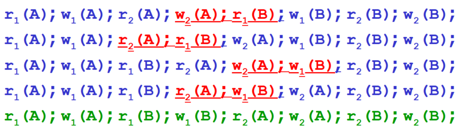
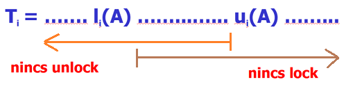
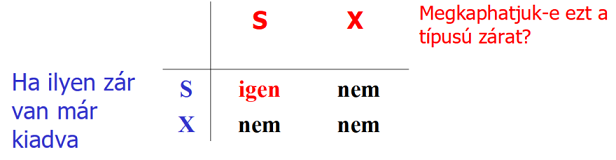
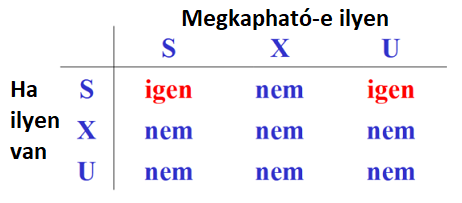
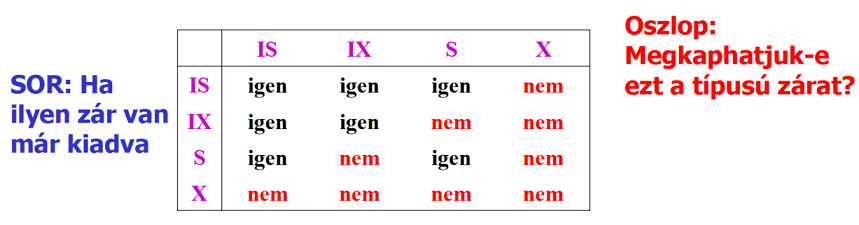
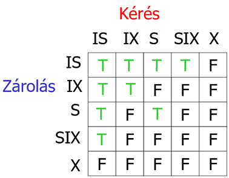

\def\ojoin{\setbox0=\hbox{$\bowtie$}%
	\rule[-.02ex]{.25em}{.4pt}\llap{\rule[\ht0]{.25em}{.4pt}}}
\def\leftouterjoin{\mathbin{\ojoin\mkern-5.8mu\bowtie}}
\def\rightouterjoin{\mathbin{\bowtie\mkern-5.8mu\ojoin}}
\def\fullouterjoin{\mathbin{\ojoin\mkern-5.8mu\bowtie\mkern-5.8mu\ojoin}}

\def\tef{\to\to}

Készült Kiss Attila előadásai alapján.

Sárközi Gergő, 2022-23-1. félév  
Nincsen lektorálva!

# Napló (naplo.ppt)

## 144. Mit jelent a konzisztens állapot és mit jelent a konzisztens adatbázis? (2 pont)

*4. oldal, 2 pontja.*

Konzisztens állapot: összes feltétel (megszorítás) ki van elégítve

Konzisztens adatbázis: az adatbázis konzisztens állapotban van

## 145. Mit hívunk tranzakciónak és mi jellemző rá? (4 pont)

*10. oldal, definíció a cím alatt, illetve az ábra alatti 4 sor.*

Tranzakció: adatkezelő műveletek sorozata, amely sorozat a konzisztenciát megtartja.

Ha egy tranzakció konzisztens állapotból indul és a tranzakció csak egyedül fut le,
akkor a tranzakció konzisztens állapotban hagyja az adatbázist.

## 146. Mit jelent a tranzakció atomossági tulajdonsága? (2 pont)

*15. oldal, Atomosság bekezdése*

Atomosság, atomicity: tranzakciókat vagy teljesen végrehajtuk, vagy egyáltalán nem.

## 147. Mit jelent a tranzakció konzisztencia tulajdonsága? (2 pont)

*15. oldal, Konzisztencia bekezdése.*

Konzisztencia, consistency: a tranzakció megőrzi az adatbázis konzisztenciáját,
azaz a tranzakció végrahajtási után is teljesüljenek a megszorítások.

## 148. Mit jelent a tranzakció elkülönítési tulajdonsága? (2 pont)

*15. oldal, Elkülönítés bekezdése.*

Elkülönítés, isolation: minden tranzakció látszólag úgy fut le, mintha párhuzamosan nem futna vele együtt másik tranzakció.

## 149. Mit jelent a tranzakció tartóssági tulajdonsága? (2 pont)

*15. oldal, Tartósság bekezdése.*

Tartósság, durability: egy befejezett tranzakció hatása nem veszhet el (akkor se, ha a befejzés után egyből elmegy az áram).

## 150. A tranzakció-feldolgozónak milyen három feladata van? (3 pont)

*17. oldal, első 3 pont.*

- Naplózás
- Konkurenciavezérlés
- Holtpont feloldás

## 151. A tranzakciók melyik tulajdonságát biztosítja a naplózás? (1 pont)

*17. oldal, naplózás alatti zöld mondat.*

Tartósság, durability.

## 152. A tranzakciók melyik tulajdonságát biztosítja a konkurenciakezelés? (1 pont)

*18. oldal, 1. kék mondat.*

Elkülönítés, isolation.

## 153. Mi az ütemező feladata? (2 pont)

*18. oldal, 2. pont, zöld mondat.*

Összetett tranzakciók résztevékenységeinek egy olyan sorrendjét kell meghatároznia, amely biztosítja az elkülönítést (isolation-t).
Azaz elemi tevékenységek olyan sorrendje kell, amely esetén az összhatás megegyezik azzal,
mintha a tranzakciókat nem párhuzamosan, hanem egymás után hajtottuk volna végre.

## 154. Mitől sérülhet a konzisztencia? (4 pont)

*21. oldal, 4 piros címszó.*

- Tranzakcióhiba (hibásan megírt vagy rosszul ütemezett vagy félbehagyott tranzakció)
- Adatbázis-kezelési hiba (adatbázis-kezelő hibás: nem végzi helyesen a dolgát)
- Hardverhiba
- Adatmegosztásból származó hiba

## 155. A belső társérülés elleni védekezés milyen két lépésből áll? (4 pont)

*35. oldal, 1. és 2. pont.*

- Felkészülés a hibára: naplózás
- Hiba után helyreállítás: napló segítségével egy konzisztens állapot helyreállítása

## 156. Mit hívunk adatbáziselemnek? (2 pont)

*36. oldal, 2. bekezdés mondata.*

Adatbáziselem: fizikai adatbázisban tárolt adatok funkcionális egysége, amelyet tranzakciókkal lehet lekérdezni és módosítani.

## 157. A tranzakció és az adatbázis kölcsönhatásának milyen három fontos helyszíne van? (3 pont)

*37. oldal, 1,2,3. pont.*

- Adatbáziselemeket tartalmazó lemezblokkok
- Pufferkezelő által használt (virtuális vagy valós) memóriaterület
- Tranzakció memóriaterülete

## 158. Mit jelent az INPUT(X) művelet? (2 pont)

*39. oldal, 1. pont.*

Az $X$ adatbáziselemet tartalmazó lemezblokk másolása a memóriapufferbe.

## 159. Mit jelent a READ(X,t) művelet? (4 pont)

*39. oldal, 2. pont.*

Az $X$ adatbáziselem bemásolása a tranzakció $t$ változójába.
Ha az $X$ adatbáziselemet tartalmazó blokk nincs még a memóriapufferben, akkor előtte még az $INPUT(X)$ végrehajtódik.

## 160. Mit jelent a WRITE(X,t) művelet? (4 pont)

*39. oldal, 3. pont.*

A tranzakció $t$ változójának tartalma bemásolódik az $X$ adatbáziselem memóriapufferbeli tartalmába.
Ha az $X$ adatbáziselemet tartalmazó blokk nincs még a memóriapufferben, akkor előtte még az $INPUT(X)$ végrehajtódik.

## 161. Mit jelent az OUTPUT(X) művelet? (2 pont)

*39. oldal, 4. pont.*

Az $X$ adatbáziselemet tartalmazó memóriapuffer kimásolása lemezre.

## 162. Adjuk meg az Undo naplózás U1 és U2 szabályát! (4 pont)

*50. oldal teljesen.*

U1: ha egy tranzakció módosít egy adatbáziselemet, akkor a <tranzakció, adatbáziselem, régi érték> naplóbejegyzést azelőtt kell a lemezre írni, mielőtt az új értéket.

U2: ha egy tranzakció hibamentesen befejeződött, akkor a <tranzakció, COMMIT> naplóbejegyzést csak azután szabad a lemezre írni, ha a tranzakció által módosoított összes adatbáziselem már a lemezre iródott, de ezután rögtön.

## 163. Adjunk meg egy példát Undo naplózás esetén a lemezre írás sorrendjére! (6 pont)

*52. oldal teljesen, de lehet más példa is.*

## 164. Adjuk meg Undo naplózás esetén a helyreállítás algoritmusát! (8 pont)

*54. oldal teljesen.*

- Azokkal a tranzakciókkal kell foglalkozni, amelyekhez van <Ti, start> a naplóban, de nincs se <Ti, commit>, se <Ti, abort>.
- Visszafelé haladva a naplón, egy ilyen tranzakcióhoz tartozó <Ti, X, v> naplóbejegyzés esetén ezeket kell csinálni: write(X,v), output(X).
- Végül minden ilyen tranzakciót abortálni kell: <Ti, abort>.
- Befejezésül írjuk ki a naplót a háttértárra.

## 165. Adjunk meg a működés közbeni ellenőrzőpont képzésének lépéseit Undo naplózás esetén! (6 pont)

*65. oldal, a módszer lépései*

- \<START CKPT(T1,...,Tk)> ahol T1,...,Tk az aktív tranzakciók (majd flush log)
- Meg kell várni, amíg T1,...,Tk mind befejeződik (normálisan vagy abnormálisan). Közben újabb tranzakciók indulhatnak.
- Végezetül \<END CKPT> és flush log

## 166. Ha UNDO naplózás utáni helyreállításkor előbb \<END CKPT> naplóbejegyzéssel találkozunk, akkor meddig kell visszamenni a napló olvasásában? (2 pont)

*68. oldal*

A legközelebbi korábbi \<START CKPT(T1,...,Tk)> naplóbejegyzésig.

## 167. Ha UNDO naplózás utáni helyreállításkor előbb \<START CKPT(T1,…,Tk)> naplóbejegyzéssel találkozunk, akkor meddig kell visszamenni a napló olvasásában? (2 pont)

*69. oldal, 2. pont és első alpontja.*

A T1,...,Tk tranzakciók nem lettek befejezve, így ezek közül a legkorábban indított indulásáig kell visszamenni a naplóban.

## 168. Adjuk meg a REDO naplózás esetén a lemezre írás sorrendjét 5 lépésben! (5 pont)

*75. oldal, teljesen.*

- ha a T tranzakció v-re módosítja egy X adatbáziselem értékét: <T,X,v> naplóba írása
- flush log
- COMMIT naplóba és lemezre írása
- adatbáziselemek értékeinek cseréje a lemezen
- <T,end> naplóba és lemezre írása

## 169. Adjuk meg a REDO naplózás esetén az R1 szabályt! (2 pont)

*74. oldal.*

R1: mielőtt bármely X adatbáziselemet a lemezen módosítanánk, az összes <T,X,v> és a <T,COMMIT> naplóbejegyzéseknek a lemezre kell kerülnie.

## 170. Adjunk meg egy példát REDO naplózás esetén a lemezre írás sorrendjére! (6 pont)

*76. oldal teljesen, de lehet más példa is.*

## 171. Adjunk meg REDO naplózás esetén a helyreállítás algoritmusát! (8 pont)

*78. oldal teljesen.*

- Azokkal a tranzakciókkal kell foglalkozni, amelyekhez van <Ti,COMMIT>, de nincs <Ti, end> a naplóban.
- Előrefelé haladva a naplóban, egy ilyen tranzakcióhoz tartozó <Ti,X,v> naplóbejegyzés esetén ezeket kell csinálni: write(X,v), output(X).
- Végül minden ilyen tranzakciót be kell fejezni: <Ti,END>.

## 172. Mi jellemző a módosított REDO naplózásra? (8 pont)

*79. oldal, első bekezdés 3 sora.*

Befejezett tranzakciók <Ti,END>-del való jelölése helyett a be nem fejezettek vannak megjelölve <Ti,ABORT>-tal.

## 173. Fogalmazzunk meg 3 különbséget az UNDO és REDO naplózás esetén! (3 pont)

*83. oldal, utolsó 3 pontja.*

- Az adat változás utáni (és nem előtti) értéket jegyezzük fel a naplóba
- A kiírás elé rakjuk a COMMIT-ot, így megtelhet a puffer
- REDO esetén el lehet halasztani az írást (UNDO esetleg túl gyakran akarhat írni)

## 174. Mit hívunk piszkos puffereknek? (1 pont)

*84. oldal, utolsó pontja (értelemszerűen)*

Végrehajtott, de lemezre még ki nem írt módosítások vannak benne.

## 175. Adjuk meg a működés közbeni ellenőrzőpont képzésének lépéseit REDO naplózás esetén! (6 pont)

*85. oldal, a módszer 3 lépése*

- \<START CKPT(T1,...,Tk)> ahol T1,...,Tk az aktív tranzakciók (majd flush log)
- Az összes \<START CKPT> előtt befejeződött tranzakciók által írt adatbáziselemet a lemezre kell írni
- Végezetül \<END CKPT> és flush log

## 176. Adjuk meg az UNDO/REDO naplózás esetén az UR1 szabályt! (2 pont)

*94. oldal.*

UR1: <T,X,v,w> naplóbejegyzésnek lemezre kell kerülnie, mielőtt az X adatbáziselem a lemezen módosul

## 177. Adjuk meg az UNDO/REDO naplózás esetén a WAL elvet! (2 pont)

*94. oldal.*

Write After Log elv: előbb naplózunk, utána módosítunk

## 178. Hová kerülhet a COMMIT az UNDO/REDO naplózás esetén? (2 pont)

*94. oldal, 4. pont.*

A <T, COMMIT> bejegyzés meg is előzheti és követheti is az adatbáziselemek lemezen történő bármilyen megváltozását.

## 179. Adjunk meg egy példát UNDO/REDO naplózás esetén a lemezre írás sorrendjére! (6 pont)

*95. oldal teljesen, de lehet más példa is.*

Megjegyzés: a <T,COMMIT> naplóbejegyzés kerülhetett volna 9 elé vagy 11 után is

## 180. Mi az UNDO/REDO naplózás esetén a helyreállítás 2 alapelve? (4 pont)

*96. oldal 1,2 pontok.*

- REDO: legkorábbitól kezdve allítsuk helyre minden befejezett tranzakció hatását
- UNDO: legutolsótól kezdve tegyük semmissé minden be nem fejezett tranzakció tevékenységét

## 181. Mi lehet probléma az UNDO/REDO naplózás esetén? (2 pont)

*100. oldal, első pont.*

<T, COMMIT> naplóbejegyzés lemezre írása előtt fellépő hiba utáni helyreállítás során a rendszer a felhasználó számára befejezettnek tűnő tranzakció hatásait semmissé teszi ahelyett, hogy helyreállította volna őket

## 182. Adjuk meg az UR2 szabályt az UNDO/REDO naplózás esetén? (2 pont)

*100. oldal, 3. pont.*

UR2: a <T,COMMIT> bejegyzést a naplóba kerülés után egyből a lemezre kell írni

## 183. Adjunk meg a működés közbeni ellenőrzőpont képzésének lépéseit UNDO/REDO naplózás esetén! (6 pont)

*102. oldal, a módszer 3 lépése*

- \<START CKPT(T1,...,Tk)> ahol T1,...,Tk az aktív tranzakciók (majd flush log)
- Össses piszkos puffer (módosított adatbáziselem(ek)et tartalmazó pufferek) lemezre írása
- Végezetül \<END CKPT> és flush log

## 184. Adjunk meg a működés közbeni mentés 5 lépését! (5 pont)

*116. oldal, a módszer 5 lépése*

- \<START DUMP> naplóba írása
- Naplózási módnak megfelelő ellenőrzőpont készítése
- Adatlemezek teljes vagy növekményes mentése
- Napló mentése, ami tartalmazza legalább a második pontban készített ellenőrzőponthoz tartozó naplóbejegyzéseket
- \<END DUMP> naplóba írása

## 185. Az Oracle milyen naplózást valósít meg? (2 pont)

*123. oldal, 1. pont*

UNDO és REDO naplózás speciális keverékét.

## 186. Az Oracle mit használ UNDO naplózás céljára? (3 pont)

*123. oldal, 2. pont, mindhárom mondata*

Egy vagy több rollback szegmenst, amelyek a tranzakciók által módosíott adatok régi értékeit tárolják attól függetlenül, hogy a lemezre íródtak-e már a módosítások.

Rollback szegmensek segítségével van az olvasási konzisztencia, tranzakciók visszagörgetése és az adatbázis helyreállítása megvalósítva.

## 187. Az Oracle mit használ REDO naplózás céljára? (2 pont)

*119. oldal, 2. pont*

Online és archivált naplót.

## 188. Mit tartalmaz az Oracle rollback szegmense? (4 pont)

*123. oldal, 3. pont, mind a négy mondata*

- Egy rollback szegmens rollback bejegyzésekből áll
- Egy rollback bejegyzés tartalmazza a megváltozott blokk azonosítóját és a blokk régi értékét
- Egy rollback bejegyzés előbb kerül a rollback szegmensbe, mint ahogy megtörténik a módosítás
- Azonos tranzakcióhoz tartozó bejegyzések láncolva vannak gyors keresés érdekében

# Konkurencia (konkurencia.ppt)

## 189. Milyen problémát kell megoldania a konkurrencia-vezérlésnek? (4 pont)

*2. oldal, alsó 3 zöld sor*

Tranzakciók hathatnak egymásra, ami miatt az adatbázis inkonzisztenssé válhatnak, akkor is, ha rendszerhiba nem történik és a tranzakciók külön-külön megőriznék a konzisztenciát.

## 190. Mit hívunk ütemezőnek? (2 pont)

*3. oldal, 1. pont*

Tranzakciós lépések szabályozását végző része az adatbázis-kezelő rendszernek.

## 191. Mit hívunk ütemezésnek? (2 pont)

*3. oldal, 5. pont*

Egy vagy több tranzakció által végrehajtott lényeges műveletek időrendben vett sorozata.
Egy adott tranzakcióhoz tartozó műveletek sorrendje megegyezik a tranzakcióban megadott sorrenddel.

## 192. Milyen 2 módon biztosítja az ütemező a sorbarendezhetőséget? (2 pont)

*4. oldal, 1. bekeretezett rész.*

- Várakoztat
- Abortot rendel el

## 193. Mit hívunk konfliktuspárnak? (2 pont)

*11. oldal, 3. pont*

Egymást követő műveletpár az ütemezésben, melyek sorrendjének a felcserélése legalább az egyik tranzakció viselkedésének megváltozásával jár.

## 194. Milyen 3 esetben nem cserélhetjük fel a műveletek sorrendjét, mert inkonzisztenciát okozhatna? (3 pont)

*13. oldal, a 3 piros sor. (A sorszámozás nyilván a),b),c) akart lenni.)*

- $r_i(X); \; w_i(Y)$
- $w_i(X); \; w_j(X)$
- $r_i(X); \; w_j(X)$

## 195. Mikor konfliktus-ekvivalens 2 ütemezés? (2 pont)

*14. oldal, 2. pont*

Ha szomszédos műveletek konfliktusmentes cseréinek sorozatával az egyiket a másikká alakíthatjuk.

## 196. Mikor konfliktus-sorbarendezhető egy ütemezés? (2 pont)

*14. oldal, 3. pont*

Ha konfliktusekvivalens valamely soros ütemezéssel.

## 197. Mi a konfliktus-sorbarendezhetőség elve? (3 pont)

*14. oldal, 1. pont, teljesen*

Konfliktusmentes cserékkel megpróbáljuk az ütemezést soros ütemezéssé alakítani.
Ha ez sikerül, akkor az ütemezés sorbarendezhető volt, mivel az adatbázisra való hatása ekvivalens marad.

## 198. Mi a kapcsolat a sorbarendezhetőség és a konfliktus-sorbarendezhetőség között? (2 pont)

*14. oldal, 3, 4. pont röviden*

A konfliktus-sorbarendezhetőség elégséges (de nem szükséges) feltétele a sorbarendezhetőségnek.

## 199. Az $r_1(A)$; $w_1(A)$; $r_2(A)$; $w_2(A)$; $r_1(B)$; $w_1(B)$; $r_2(B)$; $w_2(B)$; ütemezést alakítsuk soros ütemezéssé (5 pont)

*15. oldal, az átalakítás 5 sora*

## 200. Adjunk példát sorbarendezhető, de nem konfliktus-sorbarendezhető ütemezésre (4 pont)

*17. oldal S2 példája, mert hatása megegyezik a soros S1-gyel (Si-ket részletezni!)*

- Legyen $S$: $w_1(Y); \; w_2(Y); \; w_2(X); \; w_1(X); \; w_3(X);$
- Ekkor $S$ sorbarendezhető, de nem konfliktusmentes-sorbarendezhető ütemezés
- Sorbarendezhető, mert $w_1(X)$ és $w_2(X)$-től függetlenül $w_3(X)$ felül fogja írni az értéket, tehát az eredmény azonos lesz.
- Nem konfliktusmentes-sorbarendezhető, mert konfliktusmentes cserékkel nem tudjuk sorba rendezni.

## 201. Mi a konfliktus-sorbarendezhetőség tesztelésének alapötlete? (2 pont)

*18. oldal, 1. pont*

Ha konfliktusban álló műveletek szerepelnek egy ütemezésben, akkor a konfliktus-ekvivalens soros ütemezésben a műveletekkel azonos sorrendben kell a műveleteket tartalmazó tranzakcióknak előfordulniuk.

## 202. Mikor mondjuk, hogy egy S ütemezés alapján $T_1$ megelőzi $T_2$-t? (5 pont)

*19. oldal, 1. pont a feltétel 1,2,3 pontjaival együtt.*

Ha van a $T_1$-ben olyan $A_1$ művelet és a $T_2$-ben olyan $A_2$ művelet, hogy:

- $A_1$ megelőzi $A_2$-t $S$-ben, és
- $A_1$ és $A_2$ ugyanarra az adatbáziselemre vonatkoznak, és
- $A_1$ és $A_2$ közül legalább az egyik írás művelet

## 203. Adjuk meg egy S ütemezéshez tartozó megelőzési gráf definícióját! (5 pont)

*19. oldal, utolsó pont, teljesen.*

Csúcsok az $S$ ütemezés tranzakciói, ahol a $T_i$ tranzakcióhoz tartozó csúcsot $i$-vel jelöljük.
Az $i$ csúcsból a $j$ csúcsba akkor vezet irányított él, ha $T_i <_s T_j$.

## 204. Milyen kapcsolat van a konfliktus-ekvivalencia és a megelőzési gráfok között? (4 pont)

*20. oldal, lemma és 21. oldal megjegyzése*

$S_1$ és $S_2$ konfliktusekvivalens $\implies$ $S_1$ és $S_2$ megelőzési gráfja megegyezik (fordított irányban az implikáció nem áll fent)

## 205. Adjunk példát arra, hogy két ütemezés megelőzési gráfja megegyezik, de nem konfliktus-ekvivalensek! (4 pont)

*21. oldal ellenpéldája*

$S_1 \;=\; w_1(A); \; r_2(A); \; w_2(B); \; r_1(B)$  
$S_2 \;=\; r_2(A); \; w_1(A); \; r_1(B); \; w_2(B)$  
A gráfon $1$ és $2$ egymásba mutat (egy kör).

## 206. Mit hívunk egy irányított, körmentes gráf esetében a csúcsok topologikus sorrendjének? (4 pont)

*23. oldal, 1. pont*

Csúcsok egy olyan rendezését, amelyben minden $a \to b$ élre az $a$ csúcs megelőzi a $b$ csúcsot a topologikus rendezésben

## 207. Hogyan lehet tesztelni a megelőzési gráf alapján egy ütemezés konfliktus-sorbarendezhetőségét? (4 pont)

*22. oldal, TESZT*

- Ha egy megelőzési gráf tartalmaz irányított kört, akkor az ütemezés nem konfliktus-sorbarendezhető
- Ha nem tartalmaz, akkor konfliktus-sorbarendezhető és bármely topologikus sorrend megadja a konfliktus-ekvivalens soros sorrendet

## 208. Mi jellemző a passzív ütemezésre? (4 pont)

*28. oldal*

- Hagyjuk a rendszert működni
- Ütemezésnek megfelelő gráfot tároljuk
- Időnként megnézzük, hogy van-e benne kör
- Ha nincs, akkor jó volt az ütemezés

## 209. Mi jellemző az aktív ütemezésre és milyen 3 módszert lehet erre használni? (5 pont)

*29. oldal és a 30. oldal 1,2,3 pontja*

Aktív ütemezés: az ütemező megakadályozza a kör kialakulását az alábbi módszerek egyikével:

- zárak
- időbélyegek
- érvényesítés

## 210. Mit hívunk a tranzakciók konzisztenciájának zárolási ütemező esetén? (2 pont)

*32. oldal 1,2 pont középen*

- Tranzakció csak akkor olvashat/írhat egy elemet, ha azt már korábban zárolta és még nem oldotta fel
- Ha egy tranzakció zárol egy elemet, akkor később azt fel kell oldania.

## 211. Mit hívunk a zárolási ütemező jogszerűségének? (1 pont)

*32. oldal 1. pont alul*

Két tranzakció egyidejűleg nem zárolhatja ugyan azt az elemet. Előbb az egyiknek fel kell oldani a zárat.

## 212. Adjunk példát konzisztens tranzakciók jogszerű ütemezésére, ami mégsem sorbarendezhető! (6 pont)

*36. oldal teljesen, de lehet más is.*

## 213. Mit hívunk kétfázisú zárolásnak és szemléltessük rajzban is? (2 pont)

*39. oldal rajzzal együtt.*

Tranzakciókban minden zárolási művelet megelőzi az összes zárfeloldási műveletet.

## 214. Adjunk a tranzakciókra 2, az ütemezésre 1 feltételt, ami elegendő a konfliktus-sorbarendezhetőség bizonyítására! Milyen módon bizonyítható a tétel? (5 pont)

*42. oldal a tétel kimondása pontosan, és a bizonyításnál szereplő mondat.*

Tétel: konzisztens, kétfázisú zárolású tranzakciók bármely jogszerű ütemezését át lehet alakítani konfliktusekvivalens soros ütemezéssé

Bizonyítás: indukcióval, az ütemezésben részt vevő tranzakciók száma mentén

## 215. Mi a várakozási gráf és hogyan segít a holtpont felismerésében? (4 pont)

*47. oldal 1. pont és 48. oldal tételének pontos kimondása.*

Várakozási gráf: csúcsai a tranzakciók és $T_i$-ből $T_j$-be pontosan akkor vezet él, ha $T_i$ vár egy olyan zár elengedésére, amit $T_j$ tart éppen

Tétel: ütemezés során egy adott pillanatban pontosan akkor nincs holtpont, ha az adott pillanathoz tartozó várakozási gráfban nincs irányított kör

## 216. Milyen két lehetőséggel védekezhetünk a holtpont ellen? (4 pont)

*49. oldal a) és b) pontok kék mondatai pontosan.*

- Tranzakciók az összes szükséget zárat előre elkérik, és ha nem kapják meg az összeset, akkor egyet se kérnek inkább és el sem indulnak
- Tranzakciók az adategységekhez tartozó zárakat az adategységek növekvő sorrendjében kérik el (feltesszük, hogy az adategységekre van valamilyen sorrend); így lehet várakozás, de holtpont nem

## 217. Mi a kiéheztetés problémája és milyen megoldás van rá? (2 pont)

*50. oldal teljesen.*

Kiéheztetés: többen várnak egy adott zárra és egy adott tranzakció sokáig nem kapja meg a zárat: helyette mindig egy másik tranzakció kapja meg

Megoldás: mindig a legrégebb óta várakozó tranzakció kapja meg a zárolás lehetőségét (adategységenként egy FIFO sorban kell tartani a várakozókat)

## 218. Osztott és kizárólagos zárak esetén mit hívunk a tranzakció konzisztenciájának? (2 pont)

*56. oldal 1. pont és az utolsó mondat alul.*

- Nem lehet írni kizárólagos zár fenntartása nélkül
- Nem lehet olvasni valamilyen zár fenntartása nélkül
- Minden zárolást fel kell oldani

## 219. Osztott és kizárólagos zárak esetén mit hívunk az ütemezés jogszerűségének? (2 pont)

*58. oldal 1. bekezdés.*

Egy elemet vagy egyetlen tranzakció zárolja kizárólagosan, vagy több is zárolhatja osztottan, de a kettő egyszerre nem lehet.

## 220. Osztott és kizárólagos zárak esetén adjunk meg feltételeket az ütemezés konfliktus-sorbarendezhetőségére? (4 pont)

*61. oldal tételének pontos kimondása*

Tétel: konzisztens 2PL tranzakciók jogszerű ütemezése konfliktus-sorbarendezhető

## 221. Osztott és kizárólagos zárak esetén adjuk meg a kompatibilitási mátrixot! (4 pont)

*62. oldal utolsó pont, a zöld, kék, piros szövegekkel együtt*

## 222. Többmódú zárak kompatibilitási mátrixa segítségével hogyan definiáljuk a megelőzési gráfot? (5 pont)

*63. oldal 3 pont, két kék mondata pontosan*

- Megelőzési gráf csúcsai a tranzakciók
- Pontosan akkor van él $T_i$-ből $T_j$-be, ha van olyan $A$ adategység, amelyre az ütemezés során $T_i$ a $Z_k$ zárat megkapta és elengedte, majd ezután $A$-ra legközelebb $T_j$ kapott olyan $Z_l$ zárat, hogy a mátrixban a $Z_k$ sor $Z_l$ oszlopában "nem" áll

## 223. Többmódú zárak esetén a megelőzési gráf segítségével hogy lehet eldönteni a sorbarendezhetőséget? (3 pont)

*64. oldal tétele pontosan kimondva*

Tétel: csak zárkéréseket és zárelengedéseket tartalmazó jogszerű ütemezés sorbarendezhető pontosan akkor, ha a kompatibilitási mátrix alapján felrajzolt megelőzési gráf körmentes

## 224. Adjunk példát arra, hogy egy zárolási ütemező elutasít sorbarendezhető ütemezést? (4 pont)

*65. oldal példája, valamint a kék mondata, a megelőzési gráf felrajzolása és „mivel tartalmaz irányított kört a megelőzési gráf, ezért elvetné az ütemező”.*

## 225. Adjunk feltételt az ütemezés sorbarendezhetőségére tetszőleges zármodellben! (4 pont)

*66. oldal tétele pontosan kimondva.*

Tétel: ha valamilyen zármodellben egy jogszerű ütemezésben minden tranzakció követi a 2PL-t, akkor az ütemezés sorbarendezhető (a megelőzési gráf nem tartalmaz kört).

## 226. Mikor mondjuk, hogy egyik zár erősebb a másiknál? (4 pont)

*67. oldal első pont.*

$L_2$ erősebb $L_1$-nél, ha a kompatibilitási mátrix $L_2$ sorában/oszlopában minden pozícióban "nem" áll, ahol $L_1$ sorában/oszlopában is "nem" áll.

## 227. Adjuk meg a módosítási zár kompatibilitási mátrixát és értelmezzük röviden! (4 pont)

*70. oldal a mátrix és az alatta lévő mondat.*

A módosítási zár...

- amikor kérjük, akkor osztott zárnak néz ki
- amikor már megvan, akkor kizárolagos zárnak néz ki

## 228. Mi az $inc_i(X)$ művelet és adjuk meg a növelési zár kompatibilitási mátrixát! (4 pont)

*72. oldal 4. pont és 73. oldalon a mátrix.*

A $T_i$ tranzakció megnöveli az $X$ adatbáziselemet valamilyen konstanssal.

## 229. Adjunk meg a zártábla egy lehetséges formáját, a mezők tartalmát magyarázzuk is el! (8 pont)

*83. oldal összes ábrája, csoportos módra vonatkozó mondat, 84. oldalon várakozási bit mondata, 85 oldalon az ábra alatti szöveg a lista tartalmáról.*

Csoportos mód az adatelemre kiadott legerősebb zár: S osztott(ak)at, U módosításit és akár osztott(ak)at, X kizárólagos zárat jelent.

Várakozási bit megadja, hogy van-e legalább egy olyan tranzakció, amely az $A$ zárolására várakozik.

Lista tartalmazza $A$-t jelenleg zároló és $A$ zárolására várakozó tranzakciókat.

- Tranz: tranzakció neve
- Mód: zárolás módja
- Vár?: tranzakció várakozik-e a zárra (alternatíva: fenntartja a zárat)
- TKöv: tranzakció követkető bejegyzése
- Köv: lista következő eleme

## 230. A zárfeloldások sorrendje milyen elvek alapján történhet? (3 pont)

*88. oldal 3 zöld elnevezés.*

- Első beérkezett első kiszolgálása (first come, first served)
- Elsőbbségadás az osztott záraknak (priority to shared locks)
- Elsőbbségadás a felminősítésnek (priority to upgrading)

## 231. Hierarchikus adatok esetén mi a figyelmeztető zárak használatának három alapelve? (3 pont)

*93. oldal 3 pontja.*

- Gyökérből indulva az alapelemig a kért zárnak megfelelő figyelmeztető zárakat kerünk
- Addig nem megyünk lejjebb a fában, amíg a figyelmeztető zárat meg nem kapjuk
- Konfliktusos helyzetek alsóbb szintre kerülnek a fában

## 232. Hierarchikus adatok esetén adjuk meg az osztott, kizárólagos és figyelmeztető zárakra vonatkozó kompatibilitási mátrixot? (4 pont)

*97. oldal mátrixa felül, feliratokkal.*

## 233. Hierarchikus adatok esetén miért vezetjük be az SIX zártípust és mi jellemző rá? (4 pont)

*100. oldal 2. és 3. pont.*

Azért vezetjük be, mert $IS<IX$ és $S<X$, de $IX$ és $S$ nem összehasonlítható.

$SIX$ zár jelentése: egy tranzakció $S$ és $IX$ zárat is tett egy adatelemre. Ekkor $SIX$ erősebb $S$-nél és $IX$-nél is, de ő a legegyengébb, akire ez igaz.

## 234. Adjuk meg a csoportos móddal kiegészített figyelmeztető zárakra vonatkozó kompatibilitási mátrixot! (5 pont)

*102. oldal mátrixa, T igen, F nem.*

## 235. Mit hívunk nem ismételhető olvasásnak és mi a probléma vele? (4 pont)

*108. oldal első 4 pontja.*

- Egy tranzakció egy lekérdezést kétszer végrehajt, a kettő között szünettel.
- A két végrehajtás között egy másik tranzakció módosít vagy töröl a lekérdezett táblából néhány sort.
- Az első tranzakció lekérdezését ilyenkor nem ismételhető olvasásnak nevezzük.
- A probléma az, hogy ugyan annak a lekérdezésnek más lett az eredménye a másodszori végrehajtásban.

## 236. Mit hívunk fantom soroknak? (3 pont)

*109. oldal teljesen.*

- Egy tranzakció egy lekérdezést kétszer végrehajt, a kettő között szünettel.
- A két végrehajtás között egy másik tranzakció beszúr a lekérdezett táblába néhány sort.
- Az első tranzakció második lekérdezése mást eredményt fog adni, mint az első lekérdezés.
- A megjelent többlet sorokat fantom soroknak nevezzük.

## 237. Mikor követi egy tranzakció a faprotokollt? Adjuk meg a faprotokoll 4 szabályát! (4 pont)

*121. oldal tétel fölötti kék rész teljesen.*

- Első zárat bárhova elhelyezheti
- Későbbiekben csak akkor kaphat zárat $A$-n, ha van zárja $A$ szülőjén
- Zárat bármikor feloldhatja
- Nem lehet újrazárolni: ha egy zár el lett engedve, akkor az nem kérhető megint

## 238. Hierarchiák, például B*-fa elemeinek zárolása esetén milyen feltétel adható az ütemezés sorbarendezhetőségére? (4 pont)

*121. oldal tétel pontosan kimondva (az is kell, hogy jogszerű az ütemezés!).*

Tétel: egy ütemezés sorbarendezhető, ha jogszerű és minden tranzakciója követi a faprotokollt

## 239. Mi az időbélyegzési módszer lényege? Használunk-e ilyenkor zárakat? (4 pont)

*131. oldal Időbélyegzés két alpontja pontosan. Nem használunk zárakat.*

- Minden tranzakcióhoz egy időbélyegzőt rendelünk
- Minden adatbáziselem utolsó olvasását és írását végző tranzakció időbélyegzőjét elmentjük, és összehasonlítjuk ezen értékeket, hogy a tranzakciók időbélyegzőinek megfelelő soros ütemezés ekvivalens legyen a tranzakciók aktuális ütemezésével
- Nem használunk zárakat

## 240. Adjunk meg három jellemzőt az Oracle konkurenciavezérlésére vonatkozóan! (3 pont)

*174. oldal utolsó pontja.*

- kétfázisú zárolás
- figyelmeztető protokoll
- többváltozatú időbélyegzők

## 241. Milyen olvasási konzisztenciát biztosít az Oracle és mivel éri ezt el? (3 pont)

*175. oldal piros elnevezések és 176. oldal 1. pontja.*

- Utasítás szintű olvasási konzisztencia: egy lekérdezés sohasem olvas piszkos adatot
- Tranzakció szintű olvasási konzisztencia: tranzakció összes lekérdezése a tranzakció indulásakor fennálló adatbázis állapotot látja
- Ezek eléréséhez a rollback szegmensekben tárolt adatokat használja

## 242. Adjuk meg az SQL92 ANSI/ISO szabványbanszereplő tranzakciós elkülönítési szinteket! (4 pont)

*179. oldal táblázat első oszlopa.*

- Read uncommitted (nem olvasásbiztos)
- Read committed (olvasásbiztos)
- Repeatable read (megismételhető olvasás)
- Serializable (sorbarendezhető)

## 243. Mi jellemező a nem olvasásbiztos elkülönítési szintre a piszkos, fantom, nem ismételhető olvasásokra vonatkozóan? (3 pont)

*179. oldal táblázat első sora.*

Ezek mind lehetségesek: piszkos olvasás, nem ismételhető olvasás, fantom olvasás

## 244. Mi jellemző az olvasásbiztos elkülönítési szintre a piszkos, fantom, nem ismételhető olvasásokra vonatkozóan? (3 pont)

*179. oldal táblázat második sora.*

Lehetséges: nem ismételhető olvasás, fantom olvasás  
Nem lehetséges: piszkos olvasás

## 245. Mi jellemző a megismételhető olvasás elkülönítési szintre a piszkos, fantom, nem ismételhető olvasásokra vonatkozóan? (3 pont)

*179. oldal táblázat harmadik sora.*

Lehetséges: fantom olvasás  
Nem lehetséges: piszkos olvasás, nem ismételhető olvasás

## 246. Mi jellemző a sorbarendezhető elkülönítési szintre a piszkos, fantom, nem ismételhető olvasásokra vonatkozóan? (3 pont)

*179. oldal táblázat negyedik sora.*

Ezek mind **nem** lehetségesek: piszkos olvasás, nem ismételhető olvasás, fantom olvasás

## 247. Milyen DML szintű zárakat használ az Oracle? (2 pont)

*185. oldal középső pont két alpontjával.*

Sor szintű és teljes tábla szintű.

## 248. Milyen zártípusokat használ az Oracle sorokra és táblákra? (6 pont)

*185. oldal utolsó pont és 187. oldal utolsó előtti pont 5 alpontja.*

Sorok szintén csak kizárólagos (írási) zár létezik

Táblák szintén ötféle zártípus van; ezek egyre erősebb sorrendben az alábbiak:

- row share (RS) vagy subshare (SS),
- row exclusive (RX) vagy subexclusive (SX),
- share (S),
- share row exclusive (SRX) vagy share-subexclusive (SSX)
- exclusive (X)
